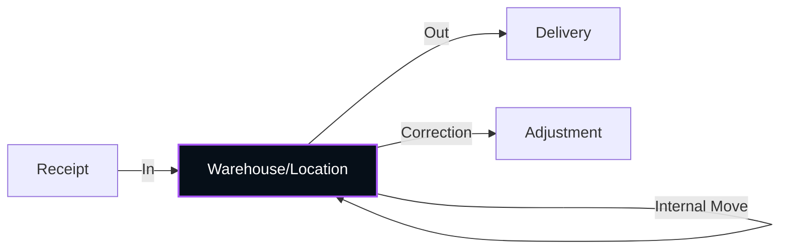

<h1 align="center">
  📦 CoreInvent
</h1>

<p align="center">
  <strong>The Ultimate Modern Inventory & Warehouse Management System</strong><br/>
  <em>Engineered for speed, precision, and visual excellence</em>
</p>

<p align="center">
  
  
  
  
  
  
</p>

---

## 🌟 Overview

**CoreInvent** is a professional-grade Inventory Management System (IMS) designed to streamline warehouse operations, from stock receipts and internal moves to complex delivery workflows. Built with a focus on real-time accuracy and a premium user experience, it empowers organizations to maintain perfect visibility over their assets across multiple locations.

The interface adheres to the **Liquid Glass** design language: high-saturation purple accents, deep navy environments, and sophisticated frosted glass layers that create a sense of depth and modern elegance.

---


## 🏗️ Architecture

```
coreinventry/
├── app/                        # Next.js App Router (16.1.6)
│   ├── (auth)/                 # Authentication flows (Login, Signup)
│   ├── (dashboard)/            # Main application shell
│   │   ├── products/           # Product & Category management
│   │   ├── operations/         # Stock moves: Receipts, Deliveries, Internal
│   │   ├── adjustments/        # Inventory count & correction workflows
│   │   ├── move-history/       # Full audit trail of all stock movements
│   │   ├── users/              # RBAC User management
│   │   └── page.tsx            # Analytics Dashboard with real-time KPIs
│   ├── api/                    # Serverless API routes
│   ├── globals.css             # Liquid Glass design tokens & Utility classes
│   └── layout.tsx              # Root configuration & Font loading
├── components/                 # Reusable UI components (Modals, Tables, Pills)
├── lib/                        # Core logic, Prisma client, and JWT utils
├── prisma/                     # Database Schema & Migrations (Prisma 7)
│   └── schema.prisma           # Comprehensive PostgreSQL data model
├── public/                     # Static assets & brand identity
├── proxy.ts                    # Edge-compatible routing & auth middleware
└── package.json                # Project dependencies & scripts
```

---

## 🔐 Role-Based Access Control

CoreInvent ensures data integrity through two distinct user roles:

| Role | Dashboard | Products | Operations | Adjustments | User Mgmt |
|---|:---:|:---:|:---:|:---:|:---:|
| **Manager** | ✅ Full Access | ✅ CRUD | ✅ Full Control | ✅ Full Control | ✅ Manage |
| **Staff** | ✅ View | 📖 Read | ✅ Process | ✅ Create | ❌ |

---

## 🔄 Inventory Lifecycle



**Automated Stock Logic:**
- **Double-Entry Bookkeeping**: Every move creates balanced `StockMoveHistory` records.
- **Location Virtualization**: Supports Scrap locations and Vendor locations for full traceability.
- **Smart Statuses**: Operations flow from `Draft` → `Waiting` → `Ready` → `Done`.

---


## 🛠️ Tech Stack

| Layer | Technology | Details |
|---|---|---|
| **Framework** | Next.js 16 | App Router, Server Components |
| **Language** | TypeScript | Strong typing across stack |
| **Database** | Prisma 7 | PostgreSQL with Neon Adapter |
| **Styling** | Tailwind CSS 4 | Modern utility-first CSS |
| **Auth** | JWT / Cookies | Secure session management |
| **Icons** | Lucide React | Clean, scalable vector icons |

---

## 📄 Project Context

This project was developed for professional inventory control, emphasizing high performance and state-of-the-art UI/UX patterns.

---
